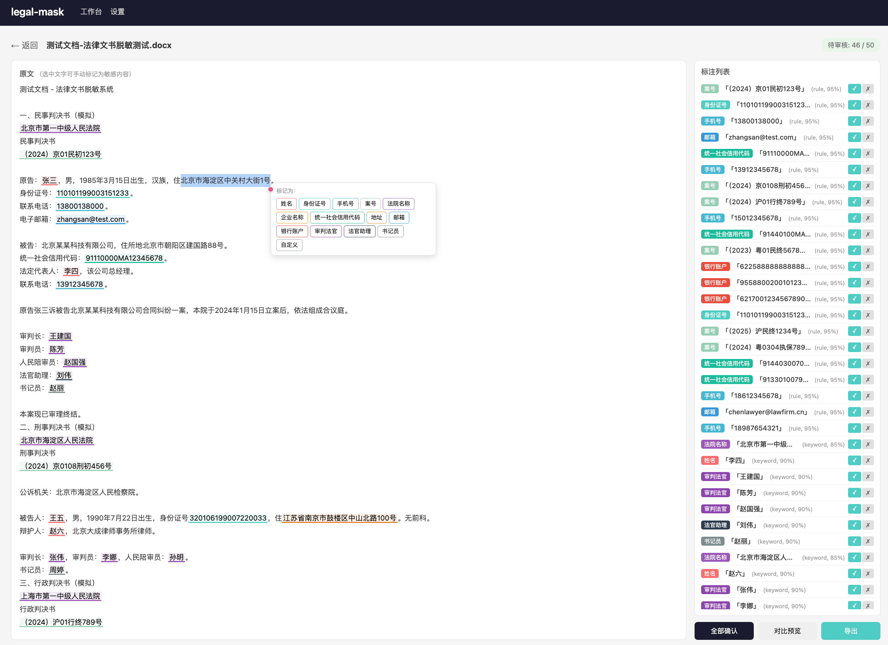

# legal-mask · 法律文档脱敏系统

[](https://www.python.org)
[](https://fastapi.tiangolo.com)
[](https://vuejs.org)

本地部署的半自动敏感信息脱敏工具，专为法律文书场景设计。上传文档 → 自动检测敏感信息 → 人工审核确认 → 导出脱敏结果，全程数据不出本机。



## 特性

- **自动检测** — 规则引擎 + 关键词匹配 + NER 模型三重检测
- **广泛覆盖** — 姓名、身份证号、手机号、案号、法院名称、企业名称、统一社会信用代码、地址、邮箱、银行账户、审判法官 / 法官助理 / 书记员、自定义标记
- **人工审核** — Web 界面逐条确认 / 忽略 / 修改标注
- **手动标注** — 在文档中直接选中文本标记敏感信息
- **格式保留导出** — DOCX 保留原文排版，支持 TXT 与原文对比导出
- **本地运行** — 无需联网，数据不离开本机
- **单文件分发** — Windows 用户可直接运行打包好的 `.exe`

## 快速开始

### 方式一：pip 安装

```bash
pip install legal-mask
legal-mask start
# 浏览器访问 http://127.0.0.1:8765
```

### 方式二：源码运行

```bash
git clone https://github.com/malcolmfeng/legal-mask.git
cd legal-mask

# 后端
pip install -r requirements.txt
python -m legal_mask start

# 前端（可选，开发时单独启动）
cd legal_mask/frontend
npm install
npm run dev
```

### 方式三：Windows 单文件版

从 [Releases](https://github.com/malcolmfeng/legal-mask/releases) 下载 `legal-mask.exe`，双击运行即可自动打开浏览器。

## 支持的文档格式

| 格式 | 解析引擎 | 导入 | 导出 |
|------|---------|------|------|
| DOCX | python-docx | ✓ | ✓（保留排版） |
| PDF  | PyMuPDF | ✓ | ✓ |
| XLSX | openpyxl | ✓ | ✓ |
| TXT  | — | ✓ | ✓ |

## 检测引擎

| 引擎 | 方式 | 覆盖类型 | 精确度 |
|------|------|---------|--------|
| 规则引擎 | 正则 + 校验和 | 身份证、手机、案号、信用代码、邮箱、银行账户 | 高（0.95） |
| 关键词匹配 | 法律关键词 + 职位识别 | 法官、法官助理、书记员、当事人、法院名称 | 中高（0.85–0.9） |
| NER 模型 | Transformers / ONNX | 人名、机构名、地址 | 中（依赖模型质量） |

## 使用流程

1. **上传文档** — 支持拖拽或文件选择
2. **自动检测** — 系统自动扫描敏感信息并标注
3. **人工审核** — 在 Web 界面逐条确认 / 忽略 / 修改
4. **手动标注** — 可在文档中选中文本添加自定义标注
5. **导出结果** — 导出脱敏后的 DOCX / TXT，或查看原文对比

> 💡 仓库中提供了一个示例文档 `examples/测试文档-法律文书脱敏测试.docx`，包含常见敏感信息格式，可直接上传测试系统功能。

## 项目结构

```
legal-mask/
├── legal_mask/
│   ├── api/              # REST API（FastAPI）
│   ├── detectors/        # 检测引擎（规则、关键词、NER）
│   ├── document_parsers/ # 文档解析（DOCX、PDF、XLSX、TXT）
│   ├── engine/           # 标注管理、脱敏、导出
│   ├── frontend/         # Vue.js 3 前端源码
│   ├── static/           # 构建后的前端静态文件
│   ├── cli.py            # 命令行入口
│   ├── server.py         # 服务器启动
│   ├── config.py         # 配置管理
│   └── types.py          # 类型定义
├── examples/             # 示例文档
├── tests/                # 测试
├── build.py              # Windows .exe 构建脚本
└── pyproject.toml
```

## 配置

配置文件位于 `~/.legal-mask/`，可通过 Web 界面的"设置"页面调整：

- 监听地址和端口（默认 `127.0.0.1:8765`）
- 上传文件大小限制（默认 50MB）
- 选择启用的敏感信息类型
- 自定义替换规则

## 构建 Windows 可执行文件

```bash
python build.py
# 输出：dist/legal-mask.exe
```

## 开发

```bash
# 安装开发依赖
pip install -r requirements.txt

# 运行测试
pytest tests/

# 前端开发（热重载）
cd legal_mask/frontend && npm run dev

# 构建前端
cd legal_mask/frontend && npm run build
```

## Tech Stack

**Backend:** Python, FastAPI, Uvicorn, Click  
**Frontend:** Vue.js 3, TypeScript, Vite, Pinia, Vue Router  
**Document Processing:** python-docx, PyMuPDF, openpyxl  
**ML Inference:** ONNX Runtime, Transformers  
**Packaging:** PyInstaller  

## License

MIT
